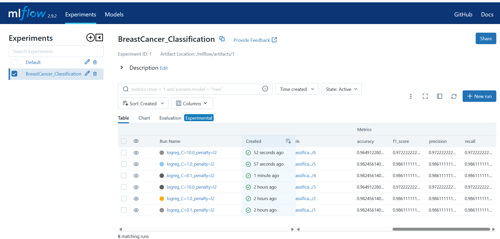

# MLflow Experiment Tracking + Dockerized Inference API (Breast Cancer Classification)

This project demonstrates a complete ML workflow using:
- MLflow for experiment tracking and model registry
- Logistic Regression model training on the Breast Cancer dataset
- Docker Compose to run everything reproducibly
- A Flask API that loads the latest registered model from MLflow and serves predictions via `/predict`

## Project Description

The goal of this project is to build a simple production-style ML pipeline:

1. Train a classification model (Breast Cancer prediction)
2. Track runs, parameters, metrics, and artifacts using MLflow
3. Register the trained model into MLflow Model Registry
4. Serve the latest model using a Dockerized Flask API

This setup mimics real-world ML deployment where:
- training happens separately,
- models are tracked and versioned,
- inference happens via an API.

## High-Level Architecture

         +---------------------+
         |     Trainer Service |
         |  (model_trainer.py) |
         |---------------------|
         | - trains model      |
         | - logs params       |
         | - logs metrics      |
         | - logs artifacts    |
         | - registers model   |
         +----------+----------+
                    |
                    | HTTP (MLFLOW_TRACKING_URI)
                    v
    +--------------------------------------+
    |            MLflow Server             |
    |--------------------------------------|
    | - Tracking UI                        |
    | - Stores runs/metrics/params         |
    | - Model Registry                     |
    | - Artifacts (scaler, plots, reports) |
    +------------------+-------------------+
                       |
                       | HTTP (Model Registry API)
                       v
         +----------------------------+
         |        Model API           |
         |   (inference_api.py)       |
         |----------------------------|
         | - loads latest model       |
         | - loads scaler artifact    |
         | - exposes /health, /predict|
         +----------------------------+

## Project Structure

Example structure (may vary slightly based on your repo):

ML_flow/
│── docker-compose.yml
│── Dockerfile
│── requirements.txt
│── experiments/ # volume mounted storage
│ ├── mlflow.db
│ └── artifacts/
│── src/
│ ├── model_trainer.py
│ ├── inference_api.py
│ ├── data_processor.py
│── README.md
## Features Implemented

### MLflow Experiment Tracking
- Logs:
  - Parameters (C, penalty, dataset name, etc.)
  - Metrics (accuracy, precision, recall, f1_score)
  - Artifacts:
    - confusion matrix plot
    - classification report
    - scaler (scaler.pkl)
- Registers model into MLflow Model Registry

### Dockerized Services
- mlflow_server: MLflow UI + backend store
- trainer: trains model and logs experiments
- model_api: serves predictions using latest registered model

## Prerequisites

Install these before running:
- Docker Desktop (Windows/Mac/Linux)
- Git
- Curl

Check versions:
```bash
docker --version
docker compose version
git --version
Clone Repository:
git clone https://github.com/23A91A4418/Ml_flow
cd ML_flow
Setup Instructions
Build and Start Everything (Recommended)
docker compose up --build


This will start:

MLflow server on port 5000

Trainer container will run once, log experiments, then exit

Model API will run on port 8000

To run in background:

docker compose up --build -d

Running MLflow Experiments

The training script runs inside the trainer container.

To manually re-run training:

docker compose run --rm trainer


Or if trainer is already created:

docker compose start trainer

Access MLflow UI

Open in browser:

http://localhost:5000

You should see:

Experiment: BreastCancer_Classification

Multiple runs with different C values

Logged metrics and artifacts

Build and Run Dockerized API

The API runs automatically when you do:

docker compose up --build


To check running containers:

docker compose ps


Expected output should show:

mlflow_server running on 5000

model_api running on 8000

API Endpoints
Health Check
curl http://localhost:8000/health


Response:

{
  "status": "ok"
}

Predict Endpoint
Example Request (curl)
curl -X POST http://localhost:8000/predict ^
  -H "Content-Type: application/json" ^
  -d "{\"features\":[[17.99,10.38,122.8,1001,0.1184,0.2776,0.3001,0.1471,0.2419,0.07871,1.095,0.9053,8.589,153.4,0.006399,0.04904,0.05373,0.01587,0.03003,0.006193,25.38,17.33,184.6,2019,0.1622,0.6656,0.7119,0.2654,0.4601,0.1189]]}"

Example Response
{
  "predictions": [0]
}
## Screenshots

### MLflow Experiments


### Model Registry

Example Request/Response Summary

Request:

{
  "features": [[...30 numeric values...]]
}


Response:

{
  "predictions": [0]
}
Design Choices

MLflow is used for experiment tracking and model versioning.

The model is registered so the inference API can always load the latest version.

The scaler is stored as an artifact so preprocessing remains consistent between training and inference.

Docker Compose ensures consistent environment setup across machines.

Flask API provides lightweight inference endpoints suitable for local testing and deployment.